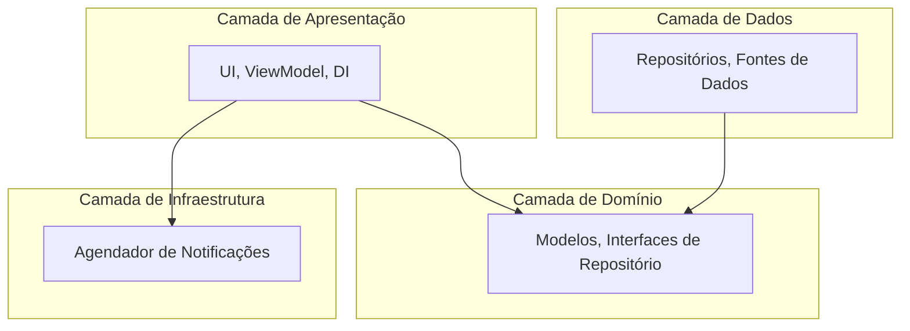
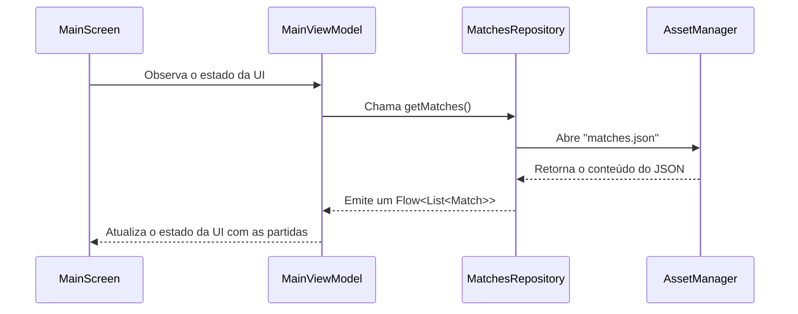

# Copa 2026 - Aplicativo Android

Este é um aplicativo Android que exibe uma lista de partidas de futebol, construído com tecnologias modernas de desenvolvimento Android.

## ✨ Funcionalidades

- **Lista de Partidas:** Exibe as partidas carregadas de um arquivo JSON local.
- **Cores Dinâmicas:** Cada card de partida é colorido com a cor principal da seleção da casa, com o texto ajustado para garantir a legibilidade.
- **Notificações:** Permite que o usuário ative ou desative notificações para partidas específicas (a implementação do agendamento de notificações está no módulo `warning-scheduler`).
- **Arquitetura Limpa:** O projeto é estruturado seguindo os princípios da Arquitetura Limpa, separando as preocupações em camadas de Domínio, Dados e Apresentação.

## 🏗️ Diagrama de Arquitetura

O projeto é dividido em módulos que representam as diferentes camadas da Arquitetura Limpa.

- **`:app`**: Contém a UI (Jetpack Compose), `ViewModel`, `Activity` e a injeção de dependências.
- **`:domain`**: Contém os modelos de negócio (`Match`, `Team`) e as interfaces dos repositórios.
- **`:data`**: Contém a implementação dos repositórios, atualmente lendo dados de um arquivo JSON local.
- **`:warning-scheduler`**: Módulo responsável por lidar com o agendamento de notificações no sistema Android.

## 🔄 Diagrama de Fluxo de Dados

O diagrama a seguir ilustra como os dados são carregados do arquivo `matches.json` e exibidos na tela.

## 🛠️ Tecnologias Utilizadas

- **Kotlin:** Linguagem de programação principal.
- **Jetpack Compose:** Toolkit de UI declarativo e moderno.
- **Coroutines & Flow:** Para programação assíncrona.
- **Arquitetura Limpa:** Para uma base de código escalável e organizada.
- **Gson:** Para analisar os dados do JSON.
- **Coil:** Para carregar imagens (bandeiras) de forma assíncrona.

## 🚀 Como Executar

1. Clone este repositório.
2. Abra o projeto no Android Studio.
3. Compile e execute no emulador ou em um dispositivo físico.
